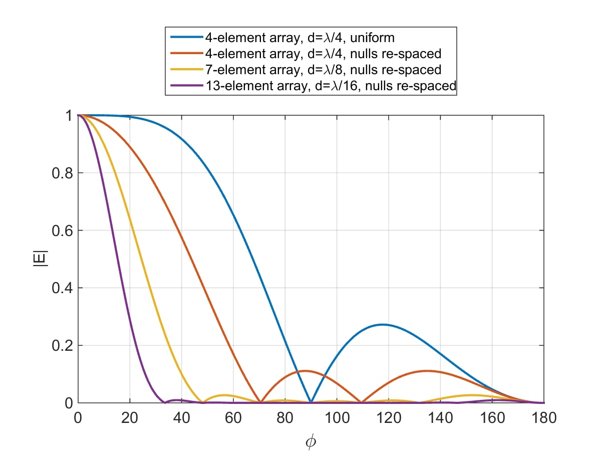

# Antenna_patterns
Compute radiation patterns of antenna-arrays.

(see [here](http://www.idc-online.com/technical_references/pdfs/electronic_engineering/Antenna_arrays.pdf) some brief intro notes to antenna arrays)

Example: [comparison of radiation patterns](broadside_endfire/null_spacing_Comparison.m)from 4 different end-fire arrays

