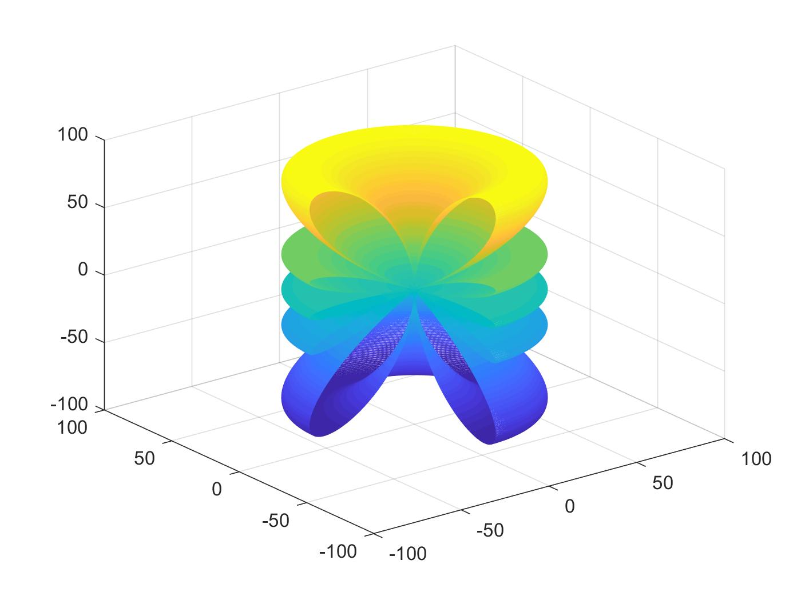

Compute radiation patterns of **dipole antennas**.

(note: end-fed dipoles are also called *traveling-wave antennas*)

**Example**: center-fed dipole, 5/2-wavelengths long (3D radiation pattern)

**Example 2**: traveling-wave antenna, 7-wavelengths long

