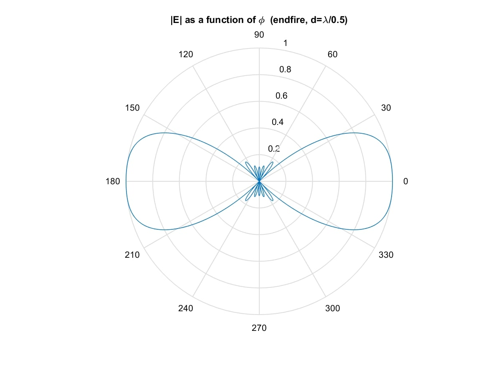
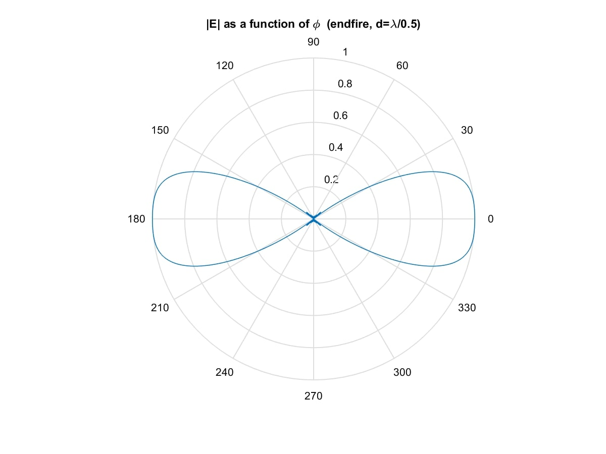

**Design antenna arrays** to follow a prescribed radation pattern **using a truncated Fourier series** (because any radiation apttern can be expressed as an infinite Fourier series, so truncating it gives an approximation). 

**Example**: design an antenna array whose radiation pattern is between -30° and 30°, and between 150° and 210°.

Using a 7-element end-fire array:

Using a 13-element end-fire array (using more terms in the Fourier series, therefore approximating the prescribed pattern better):

